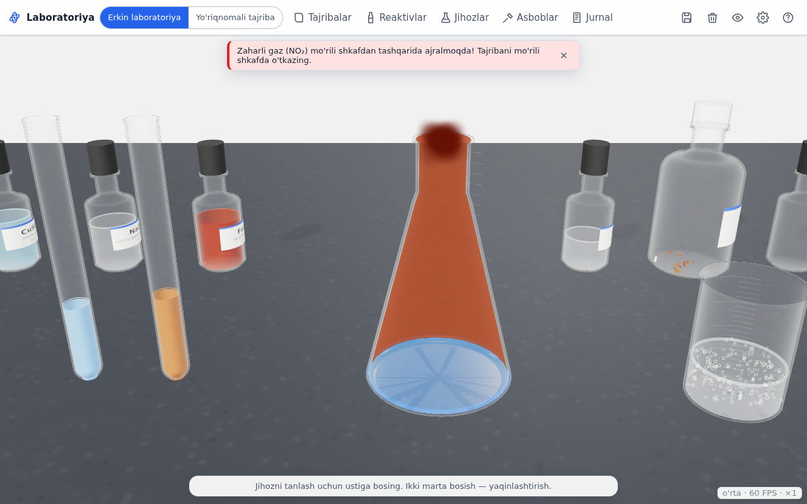
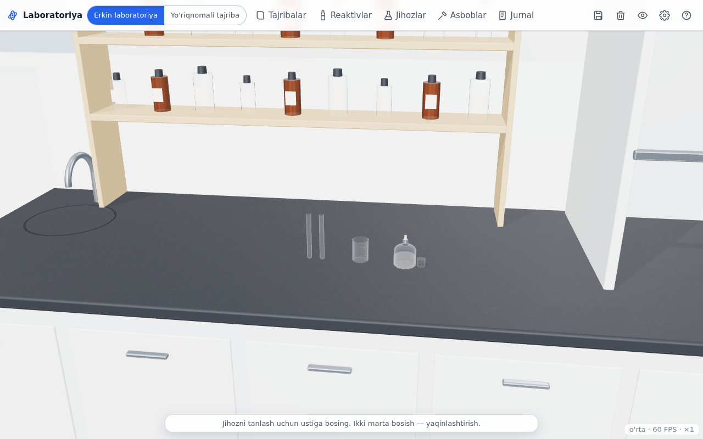
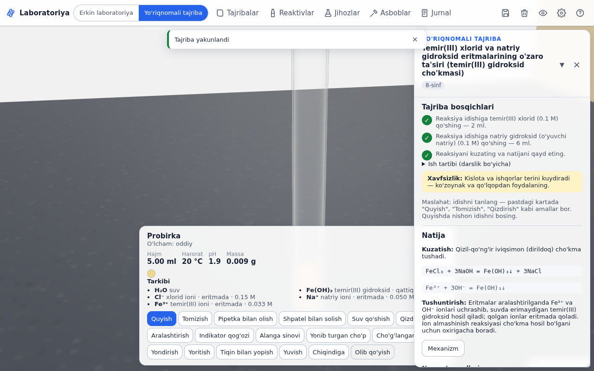
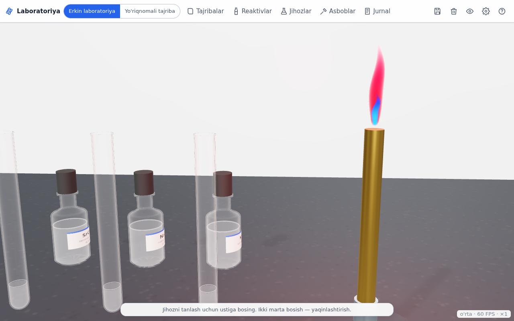
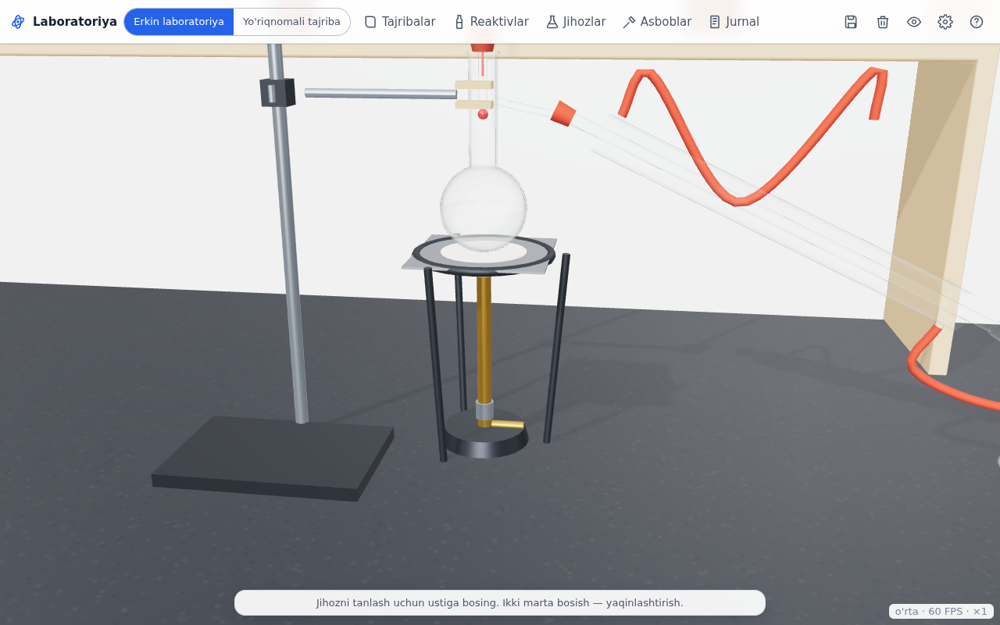
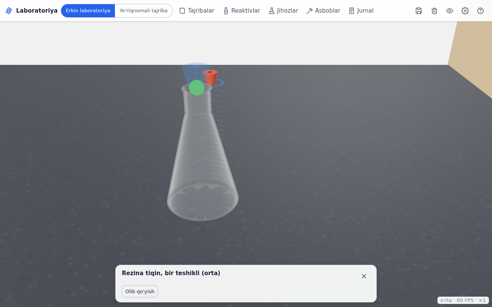
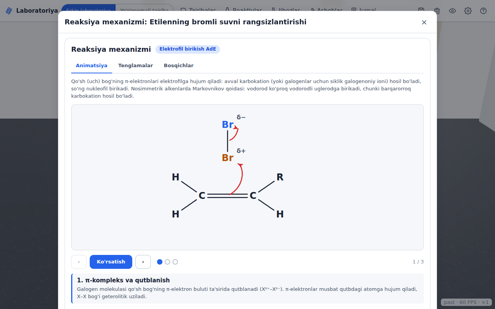

# Cognita Virtual Kimyo Laboratoriyasi

Cognita.uz uchun brauzerda ishlaydigan 3D virtual kimyo laboratoriyasi. O'quvchi stolga jihoz va reaktivlarni qo'yadi, ularni ulaydi, quyadi, qizdiradi. Natijani kimyoviy dvigatel hisoblaydi: cho'kma, gaz, rang, issiqlik va pH. Dvigatel umumiy qoidalarga va tekshirilgan tajriba yozuvlariga tayanadi. Reaksiya bormasa, sababini tushuntiradi.

- **1021 ta tajriba** 24 toifada. Har biri validatordan va dvigatel bilan muvofiqlik testidan o'tgan. 213 tasi `o'rta` deb belgilangan, ularni kimyogar tekshirishi kerak: [review/reactions_review.csv](review/reactions_review.csv).
- **672 ta modda** (shundan 360 tasi reaktivlar javonida) va **99 ta ion**.
- **115 ta jihoz** tiplangan ulanish portlari bilan, hamda **16 ta tayyor asbob andozasi**.
- **16 ta organik mexanizm** animatsiyasi; anorganik reaksiyalar uchun tenglamalar va elektron balans.
- Uchta grafika sifati: past, o'rta va yuqori. Yorug' va qorong'i mavzu. Telefon va interaktiv doska uchun moslashgan.
- Build bosqichi yo'q: vanilla JavaScript ES modullari. Three.js 0.186.1 `vendor/` ichida, CDN ishlatilmaydi.

Batafsil hisobot: [HISOBOT.md](HISOBOT.md). Arxitektura: [docs/ARCHITECTURE.md](docs/ARCHITECTURE.md). Ma'lumot sxemasi: [docs/DATA_SCHEMA.md](docs/DATA_SCHEMA.md).



## Ishga tushirish

Faqat statik server kerak, internet shart emas:

```bash
python3 -m http.server 8000 -d frontend/lab
# brauzerda: http://localhost:8000/
```

Yoki `npm run serve`. Backend bo'lmasa taraqqiyot, jurnal va saqlangan stollar brauzerning `localStorage`ida turadi.

URL parametrlari:

| Parametr | Ma'nosi |
|---|---|
| `?q=past` / `orta` / `yuqori` | grafika sifatini majburan tanlash (odatda qurilmaga qarab avtomatik tanlanadi, Sozlamalarda ham o'zgartiriladi) |
| `?exp=chokma-0001` | yo'riqnomali tajribani to'g'ridan-to'g'ri ochish |
| `?empty=1` | bo'sh stol |
| `?api=/lab` | backend manzili (boshqa usullari [backend/README.md](backend/README.md)da) |

Backend bilan ishga tushirish (FastAPI):

```bash
pip install -r backend/requirements.txt
cd backend && uvicorn example_app:app --port 8000
# http://localhost:8000/lab/?api=/lab
```

## Foydalanish

- **Kamera.** Bo'sh joyni sudrasangiz kamera aylanadi. G'ildirak yoki ikki barmoq bilan yaqinlashtiriladi. Idishga ikki marta bossangiz kamera unga fokuslanadi.
- **Jihozlar va reaktivlar.** "Jihozlar" (shkaf) va "Reaktivlar" (javon) panellaridan olinadi. Xonadagi javon va shkafni bosib ham ochish mumkin.
- **Ulash.** Jihozni sudrang. Mos portlar yashil nuqta bilan belgilanadi, yaqinlashganda ko'k oldindan ko'rinish chiqadi. Qo'yib yuborsangiz jihoz joyiga o'tiradi: tiqin bo'g'izga, naycha tiqin teshigiga, shlang naychaga, kolba qisqichga, idish plitka yoki to'rga.
- **Amallar.** Tanlangan idish kartasida quyidagi amallar bor:
  - quyish (og'ish burchagi tezlikni belgilaydi), tomizish, pipetka, shpatel, suv qo'shish;
  - qizdirish, aralashtirish, tiqin bilan yopish;
  - indikator qog'ozi, alanga sinovi, yonib turgan va cho'g'langan cho'p;
  - yondirish, yoritish, yuvish, chiqindiga to'kish.
- **Yuvish va chiqindi.** Idishni rakovinaga sudrasangiz yuviladi. Stolning chap chetiga sudrasangiz ichidagisi chiqindiga to'kiladi.
- **Yo'riqnomali rejim.** Katalogda toifa, sinf yoki matn bo'yicha qidiring va "Boshlash"ni bosing. Avval himoya vositalarini tekshirish oynasi chiqadi. Jihoz va reaktivlarni bitta tugma bilan stolga qo'yish mumkin. Bosqichlar avtomatik tekshiriladi. Oxirida kuzatish, tenglamalar, mexanizm, tushuntirish va nazorat savollari ko'rsatiladi.
- **Jurnal.** Amallar, kuzatuvlar va tenglamalar avtomatik yoziladi. Jurnalni chop etish yoki matn fayl qilib yuklab olish mumkin.
- **Saqlash.** Stolning to'liq holati saqlanadi: jihozlar, ulanishlar, idishlardagi moddalar va harorat. U `localStorage`, server yoki JSON faylga yoziladi va keyin tiklanadi.

## Tuzilma

```
frontend/lab/           statik ilova (shu papkani berish yetarli)
  index.html
  css/tokens.css        dizayn tokenlari (yorug'/qorong'i) — Cognita o'z tokenlarini shu fayl bilan ulaydi
  css/lab.css, mechanism.css
  js/engine/            kimyoviy dvigatel — DOM va Three.js'siz, Node'da test qilinadi
  js/scene/             sahna, xona, protsedura modellari, suyuqlik, effektlar (zarrachalar, alanga, tovush)
  js/lab/               stol (jihozlar, portlar), simulyatsiya, o'zaro ta'sir, asbob andozalari
  js/ui/                interfeys (panellar, inspektor, yo'riqnomali rejim, jurnal, mexanizm)
  js/i18n/uz.js         barcha interfeys matnlari (rus/ingliz tillari shu tuzilishda qo'shiladi)
  js/platform/api.js    backend yoki localStorage
  data/                 moddalar, ionlar, qoidalar, jihozlar, portlar, andozalar, mexanizmlar, reactions/*.json
  vendor/three/         Three.js 0.186.1 (npm'dan nusxa, `npm run vendor`)
backend/                FastAPI router, testlar, README
tools/                  ma'lumot generatorlari (tools/seed), validator, indekslar, skrinshotlar
tests/                  engine/ (birlik testlari), data/ (katalog testi), e2e/ (Playwright)
review/                 kimyogar uchun tekshiruv jadvali
docs/                   arxitektura, sxema, tajriba yozish qo'llanmasi, skrinshotlar, agent eslatmalari
```

## Testlar

```bash
npm test                    # dvigatel, asbob grafi, andozalar, mexanizmlar, api va 1021 tajribaning muvofiqlik testi
npm run validate -- --consistency   # validator + muvofiqlik, toifalar bo'yicha hisobot
npm run test:e2e            # Playwright (brauzerda 9 ta ssenariy)
cd backend && python -m pytest -q   # backend
```

## Ma'lumotlarni o'zgartirish

Reaksiya JSON fayllari generatorlardan yasaladi: `tools/seed/reactions/<toifa>.mjs`. Moddalar `tools/seed/*_data.mjs` va `tools/seed/extra/*.json` fayllarida turadi. Tartib:

1. Generatorni tahrirlang va `node tools/seed/reactions/<toifa>.mjs` ni ishga tushiring.
2. Yangi modda qo'shgan bo'lsangiz, `node tools/seed/build_base_data.mjs` ni ishga tushiring.
3. Indekslarni yangilang: `node tools/build_indexes.mjs`.
4. Tekshiring: `npm run validate -- --consistency`.
5. Tekshiruv jadvalini yangilang: `npm run review`.

Batafsil: [docs/REACTION_AUTHORING.md](docs/REACTION_AUTHORING.md).

## Cognita'ga ulash

1. `frontend/lab` papkasini `/lab/` yo'liga statik qilib bering.
2. `backend/lab_router.py` faylini oling. Ikki qoralama funksiyani almashtiring: `get_current_user` va `charge_coins`. Keyin `app.include_router(router, prefix="/lab")` bilan ulang.
3. `index.html` ga `<meta name="cognita-lab-api" content="/lab">` qo'shing.
4. Platforma dizayni uchun `css/tokens.css` ni Cognita tokenlari bilan almashtiring.

To'liq qo'llanma: [backend/README.md](backend/README.md).

## Skrinshotlar

`docs/screenshots/` papkasida. Skrinshotlar GPU'siz muhitda, dasturiy render (SwiftShader) bilan olingan. Haqiqiy GPU'da, ayniqsa "yuqori" sifatda, shisha va suyuqlik yaxshiroq ko'rinadi. Skrinshotlarni qayta olish uchun avval serverni ishga tushiring: `python3 -m http.server 8765 -d frontend/lab`. Keyin: `NODE_PATH=$(npm root) node tools/docs_screenshots.mjs`.

| | |
|---|---|
|  |  |
|  |  |
|  |  |
